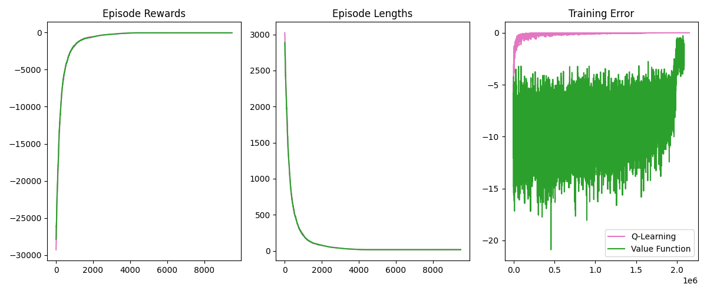
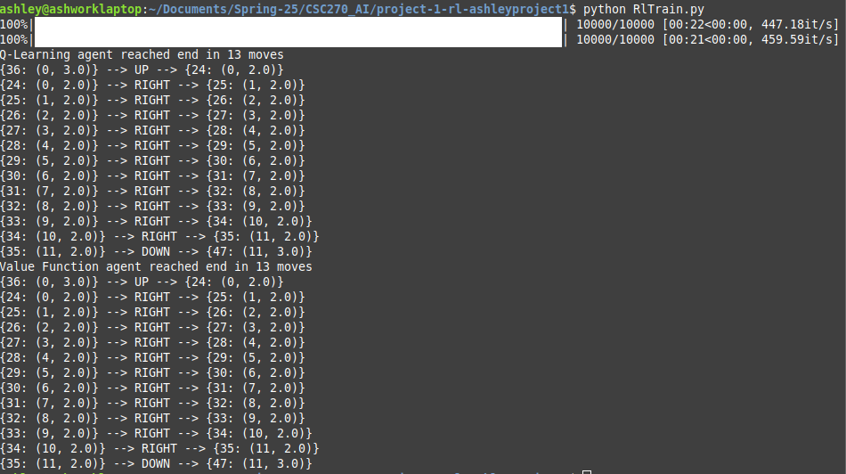

# AI - Reinforcement Learning
From Hofstra CSC270
The main Python file is `RLTrain.py`

I chose the Cliff Walking enviornment. Data on the two AI agents is below.
  

When the agents were run after training, they were both able to reach the goal in the same 13 moves. The output below shows this in the format `{State_t: (row, col)} --> action_t --> {State_t+1: (row, col)}`
  

The Hyperparameters I used are as follows:
* nEpisodes = 10,000
* learningRate (alpha) = 0.01,
* initialEpsilon = 1.0,
* epsilonDecay (lambda) = startEpsilon / (nEpisodes / 2),
* finalEpsilon = 0.1A
* discountFactor (gamma) = 0.95
